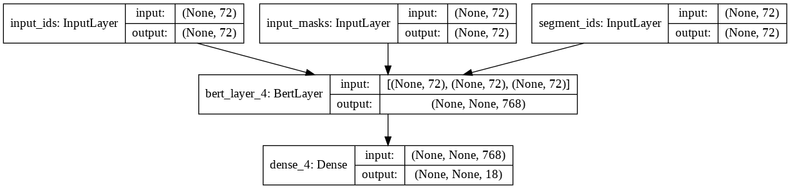

# Pos-Tagger
Α Pos Tagger trained on UD treebank with fine-tuning a BERT model

### network model structure



# Environment
- Keras==2.2.5
- nltk==3.2.5  
- pyconll
- pydot
- graphiz
- bert-tensorflow

# Dataset
Download dataset run this script or download this [link]()
```py
def download_files():
    print('Downloading English treebank...')
    urllib.request.urlretrieve('http://archive.aueb.gr:8085/files/en_partut-ud-dev.conllu', 'en_partut-ud-dev.conllu')
    urllib.request.urlretrieve('http://archive.aueb.gr:8085/files/en_partut-ud-test.conllu', 'en_partut-ud-test.conllu')
    urllib.request.urlretrieve('http://archive.aueb.gr:8085/files/en_partut-ud-train.conllu', 'en_partut-ud-train.conllu')
    print('Treebank downloaded.')
download_files()

```
# Train pos tagger model
Run script ``` train.py ```

```

------------ Result of Bert fine-tuned model ----------

              precision    recall  f1-score   support

         ADJ     0.9128    0.8884    0.9005       224
         ADP     0.9734    0.9754    0.9744       488
         ADV     0.9603    0.9237    0.9416       131
         AUX     0.9957    0.9957    0.9957       234
       CCONJ     0.9896    0.9896    0.9896        96
         DET     0.9955    1.0000    0.9977       439
        INTJ     1.0000    1.0000    1.0000         2
        NOUN     0.9661    0.9841    0.9750       753
         NUM     0.9385    1.0000    0.9683        61
        PART     0.9565    1.0000    0.9778        66
        PRON     1.0000    0.9340    0.9659       106
       PROPN     0.9605    0.8111    0.8795        90
       PUNCT     1.0000    1.0000    1.0000       339
       SCONJ     0.8600    0.8431    0.8515        51
        VERB     0.9522    0.9785    0.9652       326
           X     1.0000    1.0000    1.0000         2

    accuracy                         0.9707      3408
   macro avg     0.9663    0.9577    0.9614      3408
weighted avg     0.9706    0.9707    0.9704      3408

Accuracy: 0.9707
f1-macro score: 0.9614
Word       True  : Predicted
-----------------------------------
any        DET   : DET        
use        NOUN  : NOUN       
of         ADP   : ADP        
the        DET   : DET        
work       NOUN  : NOUN       
other      ADJ   : ADJ        
than       SCONJ : ADP   <<--- Error!
as         ADP   : ADP        
authorized VERB  : VERB       
under      ADP   : ADP        
this       DET   : DET        
license    NOUN  : NOUN       
or         CCONJ : CCONJ      
copyright  NOUN  : NOUN       
law        NOUN  : NOUN       
is         AUX   : AUX        
prohibited VERB  : VERB       
.          PUNCT : PUNCT      


```
# Model inference 
Download pretrain model [here](https://drive.google.com/file/d/1I6YtAhRWwERIzdzFiLPH-yFU_QpBshby/view?usp=sharing) and run below this script,

```inference.py```
Test sentence :
1:'Word embeddings provide a dense representation of words and their relative meanings.'
```

Word in BERT layer  | Initial word   : Predicted POS-tag
-------------------------------------------------------------
word                | word           : NOUN           
##s                 | embeddings     : NOUN           
provide             | provide        : VERB           
a                   | a              : DET            
dense               | dense          : ADJ            
representation      | representation : NOUN           
of                  | of             : ADP            
words               | words          : NOUN           
and                 | and            : CCONJ          
their               | their          : DET            
relative            | relative       : ADJ            
meanings            | meanings       : NOUN           
.                   | .              : PUNCT  
```

2: i eat rich and then i go to school

```
Word in BERT layer  | Initial word   : Predicted POS-tag
-------------------------------------------------------------
i                   | i              : PRON           
eat                 | eat            : VERB           
rich                | rich           : ADJ            
and                 | and            : CCONJ          
then                | then           : ADV            
i                   | i              : PRON           
go                  | go             : VERB           
to                  | to             : ADP            
school              | school         : NOUN   

```


